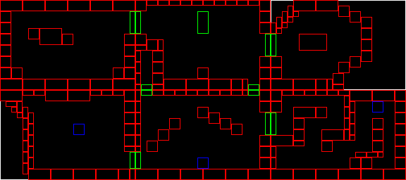
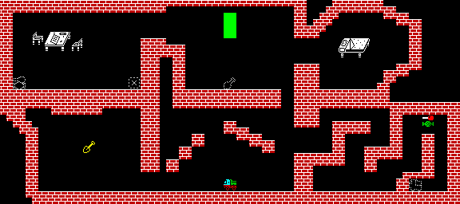

# GAME MAP DESIGN WITH MAPGEN TOOL

Map screens in RAGE1 used to be created manually: BTILES were defined
manually from PNG data or text data, and then those BTILES were manually
placed on a grid; this procedure had to be done for each and all of the
screens that form the map of the game.

This is a tedious process, so a new MAPGEN tool and its associated workflow
was designed so that this procedure can be done in a quick and efficient
way, and the most boring stages can be automated.

The tool and workflow support the following functionalities:

- BTILE positioning by copy/paste

- Automatic generation of GDATA files for each of the map screens

- Automatic HOTZONE identification and creation (for screen switching)

- Automatic FLOW rule creation for screen-switching HOTZONEs

## Requirements

- A graphical image editor (e.g.  GIMP) that has the following features:

  - Can show a configurable grid when editing an image; this is quite
  convenient for knowing the character cells that are so important in
  Spectrum graphic design

  - Can read and write PNG files

- A recent version of RAGE1 which includes the new MAPGEN tool, which is
  capable of reading a big PNG file with the whole map and output the
  required GDATA files with some configuration

- The game BTILES that are used to draw the map screens must have been
  already drawn individually and stored in one or more PNG files (several or
  all all tiles can be stored in the same PNG file if desired).  They must
  be aligned to Spectrum character cells (i.e.  8x8 pixel cells).  This
  makes selecting BTILES for copy/paste much easier when you activate the
  8x8 grid.

The present document assumes that the graphical image editor used is GIMP.

## General MAPGEN Workflow

The way of working with GIMP for creating the map can be resumed in the
following points:

- The PNG file(s) where the BTILES are stored are opened in GIMP

- The GIMP grid is activated on all images and set to 8x8-pixel cells

- A big image is created for drawing, and initialized to color black.  This
  image will contain the whole game map.

  - The grid will also be activated on this image

  - On this image, only copy/paste from the other PNG image is allowed.  No
    manual editing is allowed, so that the MAPGEN tool can do its work
    without problems later

  - All copy/paste activity on this image must be strictly aligned to the
    8x8 grid

- The game screens are created by just copying/pasting from the original
  BTILE PNGs into the main map image: go to the PNG, select a BTILE (zoom in
  and use the grid for ensuring the correct tile is copied), copy it and
  then paste it in the main map (also ensuring correct grid alignment)

- This procedure can be done quite fast and can be repeated until the whole
  game map has been drawn.

- Once the map is drawn, the HOTZONEs that allow special events to happen
  when the Hero walks over them can also be drawn on the same map: solid
  rectangles filled in green (or any other special color) shall be used, and
  can be placed anywhere on the map.  If the rectangle covers two different
  screens, the corresponding HOTZONEs will be considered screen-switching
  HOTZONEs.

Finally, the main map will need to be exported to PNG format so that it can
be read by the MAPGEN tool described in the next section.

## MAPGEN Tool

MAPGEN is a tool that uses the main map generated with the workflow
described before, and the PNG files with the BTILES, and generates GDATA
files for all the individual screens in the map, including BTILE and HOTZONE
references, and FLOW rules for screen-switching HOTZONEs.

Some assumptions:

- Screen dimensions and BTILE positioning are specified always in cell
  coords (_not_ pixel coords)

- The game screens are all the same size (R rows x C columns)

- The input data is all in PNG format

Input data:

- PNG file(s) with BTILE graphic data.  Each PNG BTILE file has an
  associated TILEDEF (.tiledef) file which indicates the name, position,
  size and default tile type (OBSTACLE, ITEM, DECORATION) for each of the
  BTILEs included in a given PNG file.

  TILEDEF files should be very easy to generate by hand when opening the PNG
  file and activating the grid.  A tiledef file is composed of lines with
  the following format, one line per BTILE (example):

  ```
  wall_2x4 2 3 2 4 obstacle
  ```

  The previous line would define a BTILE named `wall_2x4`, which is at row
  2, column 3, is 2 cells wide and 4 cells high, and has a default type of
  `OBSTACLE`.  All cell coordinates are zero-based.

  Comments are allowed, starting with the `#` char and up to the end of the
  line.  Blank lines are ignored.

- PNG file with the Main Map, as generated by the previous workflow.  The
  map PNG can optionally have an associated MAPDEF file (.mapdef), which can
  be used to specify metadata for each of the screens defined in the map
  (e.g.  screen name, hero default position, etc.)

- Screen dimensions in rows and columns (R and C values mentioned above)

- Game Area top-left coordinates (in cells): these are needed for correct
  HOTZONE generation, since HOTZONE coordinates are specified relative to
  the full Spectrum screen.

- Width and Height of the Hero sprite (in pixels): these are needed for
  correctly generating screen-switching HOTZONEs, since the hero sprite needs
  to be positioned outside of the destination screen HOTZONE to avoid
  screen-switching loops

Output:

- One GDATA file per screen, inside the `map` directory under the
  `game_data`directory.  Each screen GDATA file contains all BTILES that
  form the screen, HOTZONE definitions (which connect to adjacent screens)
  and positioning data for all items of any type

- One GDATA file per screen, inside the `flow` directory under the
  `game_data` directory, with the needed HOTZONE flow rules needed for
  screen-switching

- If the option `--generate-check-map` option was supplied, the tool also
  generates a check-map file: a PNG file with the same dimensions of the
  original Main Map PNG, which contains outlines of all the matched elements
  drawn on their respective positions.  There are different colors for each
  type of element: white (screen outlines), red (btiles), green (hotzones)
  and blue (items).

  The purpose of this file is to visually check that the objects identified
  by the tool (drawn on the check-map) match the Main Map and nothing is
  left unindentified.

- If the option `--auto-hotzones` option was supplied, MAPGEN tries to
  automatically identify the screen-switching HOTZONEs in the map, by
  matching rectangles of background color at the borders between screens
  which overlap both screens (it tries to find "holes" between screens).  It
  then automatically defines screen-switching HOTZONEs.

  The background color and the width of the generated HOTZONEs can be
  specified with additional options.  Their default values are black
  (000000) and 8 pixels, respectively.

Remarks:

- Only non-empty screens are generated.  Even if the map is MxN screens in
  size, empty screens will not be generated (so no memory is wasted)

## Example MAPGEN Usage

The following section illustrates the workflow previously indicated.

- First, the BTILE files and their associated TILEDEF files must be created.
  BTILEs are stored in one or more PNG files, similar to the following one:

  

  The associated TILEDEF file must be named the same as the PNG file but
  with a `.tiledef` extension instead of `.png`, and must be stored in the
  same directory as the BTILE PNG file.

  The TILEDEF file looks like the following example:

  ```
  candy			0 0 2 2 item
  candy_holder		0 2 2 2 decoration
  spot_1			0 4 2 2 decoration
  spot_2			0 6 2 2 decoration
  ball			0 8 2 2 item
  ball_holder		0 10 2 2 decoration
  desk			0 12 4 3 obstacle
  chair_right		0 16 2 2 obstacle
  chair_left		0 18 2 2 obstacle
  truck			2 0 2 2 item
  truck_holder		2 2 2 2 decoration
  shovel			2 4 2 2 item
  shovel_holder		2 6 2 2 decoration
  pencil			2 8 2 2 item
  pencil_holder		2 10 2 2 decoration
  bed			4 0 5 3 obstacle
  wall_1x1        4 5 1 1 obstacle
  wall_2x1        4 5 2 1 obstacle
  wall_1x2        4 5 1 2 obstacle
  wall_2x2        4 5 2 2 obstacle
  wall_4x2        4 5 4 2 obstacle
  ```

- The Main Map will be drawn by copying/pasting 8x8 cells from the BTILEs
  file. All decoration and item btiles can be put on the map, together with
  HOTZONEs.

  When finished, the example Main Map may look like this (HOTZONEs are in
  green color):

  

  The optional associated MAPDEF file must be named the same as the PNG file but
  with a `.mapdef` extension instead of `.png`, and must be stored in the
  same directory as the Map PNG file.

  The MAPDEF file looks like the following example:

  ```
  # syntax:
  # <row> <col> <metadata_var> ...
  #
  0 0 name=StartScreen dataset=0 hero_startup_xpos=20 hero_startup_ypos=20 title=The_Start
  0 1 name=Corridor dataset=0 hero_startup_xpos=20 hero_startup_ypos=20title=The_Corridor
  0 2 name=Dungeon dataset=0 hero_startup_xpos=20 hero_startup_ypos=20title=The_Dungeon
  1 1 name=Stairs dataset=0 hero_startup_xpos=20 hero_startup_ypos=20title=The_Stairs
  ```

- The MAPGEN tool will be used to generate the GDATA files. A command line
  similar to the following one will be used (all the command must be entered
  in one line):

  ```
  tools/mapgen.pl --screen-cols 24 --screen-rows 16 \
      --game-data-dir new_game_data \
      --generate-check-map \
      --game-area-top 0 --game-area-left 0 \
      --hero-sprite-width 16 --hero-sprite-height 16 \
      misc/test-tiles.png \
      misc/test-map-3x2-screens-24x16.png
  ```

  This will generate the following output:

  ```
  Checking input files...
  -- Map PNG: misc/test-map-3x2-screens-24x16.png
  -- BTile PNG: misc/test-tiles.png
  Loading BTILEs...
  -- File misc/test-tiles.png: read 21 BTILEs
  Processing Main Map...
  -- Loaded Main Map: 576x256 pixels, 32 rows x 72 columns (8x8 cells)
  -- Main Map has 2 rows of 3 screens each
  -- Screen metadata loaded from MAPDEF file
  Identifying BTILEs in Main Map...
  -- Screen (0,0): matched 27 BTILEs
  -- Screen (0,1): matched 21 BTILEs
  -- Screen (0,2): matched 25 BTILEs
  -- Screen (1,0): matched 36 BTILEs
  -- Screen (1,1): matched 20 BTILEs
  -- Screen (1,2): matched 47 BTILEs
  Scanning HOTZONEs...
  -- Identified 7 global HOTZONEs
  -- 6 HOTZONEs were split between screens
  -- 13 HOTZONEs were identified
  Generating Check-Map file...
  -- Check-Map file new_game_data/check/test-map-3x2-screens-24x16-check-map.png was created
  Generating Screen GDATA files...
  -- File new_game_data/map/AutoScreen_001_000.gdata for screen 'AutoScreen_001_000' was created
  -- File new_game_data/map/AutoScreen_001_002.gdata for screen 'AutoScreen_001_002' was created
  -- File new_game_data/map/Corridor.gdata for screen 'Corridor' was created
  -- File new_game_data/map/Dungeon.gdata for screen 'Dungeon' was created
  -- File new_game_data/map/Stairs.gdata for screen 'Stairs' was created
  -- File new_game_data/map/StartScreen.gdata for screen 'StartScreen' was created
  Generating Flow GDATA files...
  -- File new_game_data/flow/AutoScreen_001_000.gdata: for screen 'AutoScreen_001_000' was created
  -- File new_game_data/flow/AutoScreen_001_002.gdata: for screen 'AutoScreen_001_002' was created
  -- File new_game_data/flow/Corridor.gdata: for screen 'Corridor' was created
  -- File new_game_data/flow/Dungeon.gdata: for screen 'Dungeon' was created
  -- File new_game_data/flow/Stairs.gdata: for screen 'Stairs' was created
  -- File new_game_data/flow/StartScreen.gdata: for screen 'StartScreen' was created
  MAPGEN Execution successful!
  ```

- Since the `--generate-check-map` option was supplied, MAPGEN generates a
  check-map file like the following:

  

  The check-map can be compared to the original Main Map PNG to verify that
  all BTILEs, ITEMs and HOTZONEs have been correctly identified.

- Alternatively, the Main Map may not have screen-switching HOTZONEs drawn,
  and instead rely on MAPGEN's hability to identify them automatically. 
  Here is the alternative version of the Main Map without screen-switching
  HOTZONEs:

  

- MAPGEN should be invoked with the additional `--auto-hotzones` option, and
  then, the following check-map would be generated:

  

  As it can be seen, the tool has successfully identified the needed
  screen-switching HOTZONEs, which were previously specified manually.

After the successful execution of MAPGEN, the generated GDATA files can be
added to your game project and compiled in the usual way.  The screens and
their switching automations should have been defined for you and the hero
should be able to move freely inside the map, with screen switches happening
automatically as needed.

Hopefully, the process of editing a _big_ map has been quite simplified, and
now you just need to take care of the special zones of your game, since the
main map is automatically generated.

Now you can continue adding features to your game!

## Fully working example

If you just want to test a demo map with the default test game, you can just
follow this simple steps:

- Edit the `game/game_data/game_config/Game.gdata` file and change the
  `INITIAL` setting on the `SCREEN` line to `StartScreen` (this is the
  starting screen defined in the demo map `.mapdef` file)

- Run the following commands in the base directory of the RAGE1
distribution:

```
cd game

# this creates definitions for the test btiles
../tools/btilegen.pl ../misc/test-tiles.png > game_data/btiles/autobtiles.gdata

# this analyzes the map and creates all the needed map data
../tools/mapgen.pl --screen-cols 24 --screen-rows 16 \
	--game-data-dir game_data --game-area-top 1 --game-area-left 1 \
	--hero-sprite-width 16 --hero-sprite-height 16 --auto-hotzones \
	--generate-check-map \
	../misc/test-tiles.png \
	../misc/demo-map-3x2-screens-24x16.png

# go up one directory and build
cd ..
make  build
```

At this point the test game has been compiled with the demo map and the file
`game.tap` has been generated.  You can just run `make run` to execute the
TAP file in FUSE to test it.
