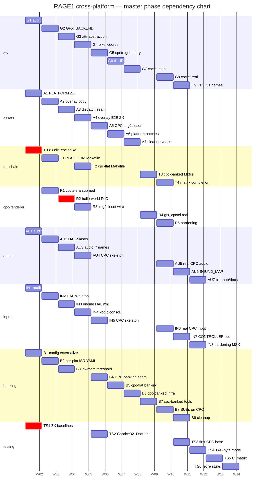
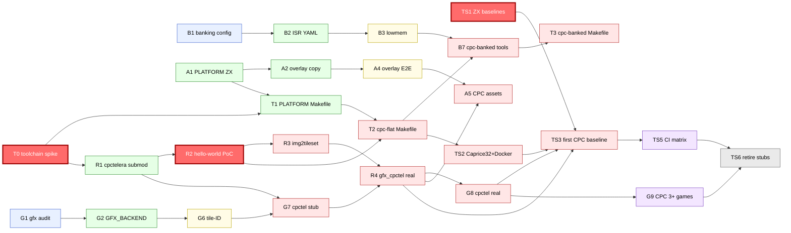
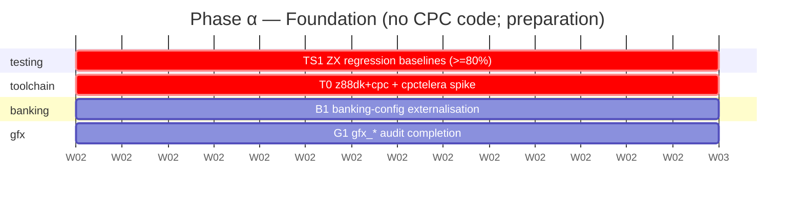
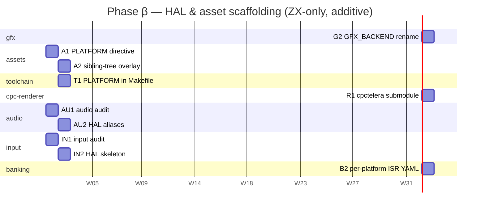
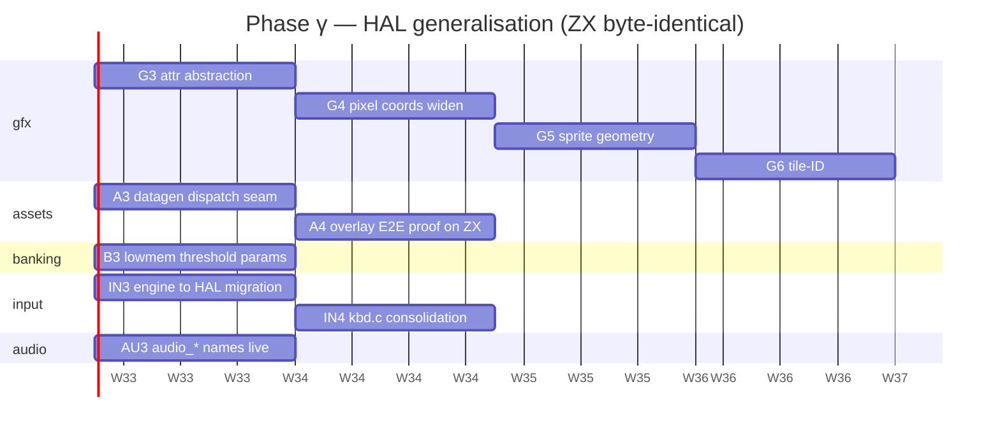
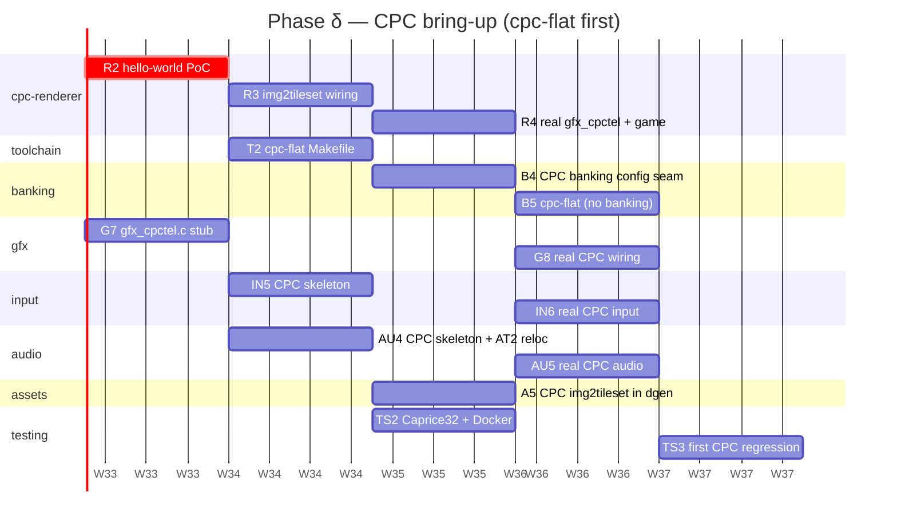
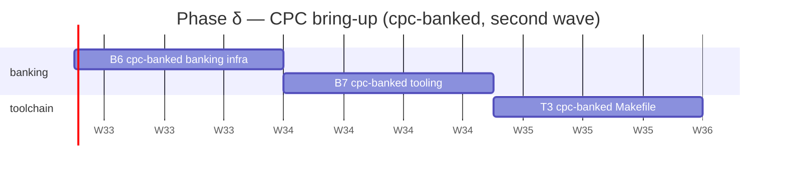
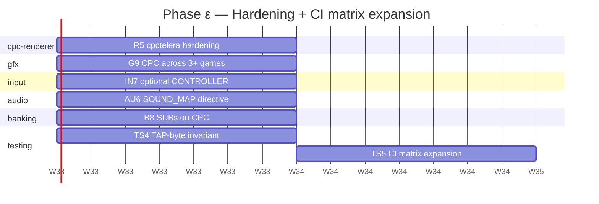
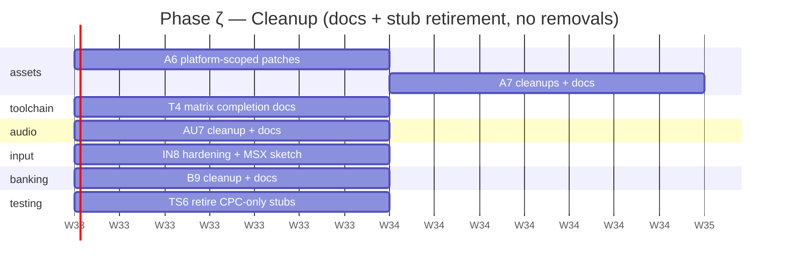

# RAGE1 cross-platform plan — Gantt / dependency charts

Graphical companion to [README §4](README.md). The 54 subsystem
phases are grouped into 6 chronological **Greek phases** (α…ζ).
Durations on every chart below are uniform placeholders — the
load-bearing content is **dependency topology** and **phase
ordering**, not calendar time.

| Greek phase | Theme | Count | CPC code? | ZX byte-identical? |
|---|---|---|---|---|
| **α** | Foundation (preparation) | 4 | no | n/a (no engine changes) |
| **β** | HAL & asset scaffolding (ZX-only, additive) | 10 | no | yes |
| **γ** | HAL generalisation | 10 | no | yes |
| **δ** | CPC bring-up (flat first, then banked) | 19 | yes | yes (ZX track preserved) |
| **ε** | Hardening + CI matrix expansion | 7 | yes | yes |
| **ζ** | Cleanup | 7 | yes | yes |

---

## 1. Master Gantt — all subsystems, all 54 phases

Swim lanes are subsystems. Horizontal position is determined by
`after` dependencies — Greek phases appear as visible vertical
bands. Tasks marked `crit` (red) are gating: their failure blocks
all CPC work that follows.

---

## 2. Cross-subsystem dependency DAG (the project "spine")

The Mermaid Gantt above shows **when** each phase runs but does
not draw explicit arrows. The flowchart below shows the
**critical cross-subsystem dependencies** — the spine that
serialises CPC bring-up. Arrows go from prerequisite to consumer.

Greek phases colour the boxes; the gating tasks (`T0`, `R2`,
`TS1`) sit on the critical path.

The two **deep-red gating boxes** are pre-CPC: nothing past them
proceeds unless they succeed.

- **TS1** — `tests/00regression/` must cover ≥ 80 % of test games
  *before* anyone refactors the engine. Without TS1's safety net
  the "ZX byte-identical" invariant every later phase asserts is
  unverifiable.
- **T0** — z88dk `+cpc` + sdcc_iy + a trivial cpctelera build,
  outside RAGE1. If T0 fails, the entire toolchain story is
  unsound; the plan returns to library survey
  ([cpc-renderer.md](cpc-renderer.md)).
- **R2** — cpctelera-SDCC-3.6.8-vs-z88dk-SDCC-4.3 hello-world.
  Most CPC work is gated on R2 succeeding; fallback is the
  cpc-renderer.md alternatives survey (CPCRSlib).

---

## 3. Per-Greek-phase Gantts

### 3.1 Phase α — Foundation

All four α phases are independent and run in parallel. Their
purpose is to prepare the ground without touching the engine
beyond config files.

**Phase-α exit signals:** ZX regression suite covers enough games
to detect future byte-level drift; `+cpc` toolchain proven outside
RAGE1; `etc/rage1-config.yml` carries everything; `gfx_*` audit
baseline frozen.

### 3.2 Phase β — HAL & asset scaffolding (ZX-only, additive)

β introduces new vocabulary (PLATFORM, GFX_BACKEND, HAL skeletons,
sibling-tree overlay machinery) without changing engine
semantics. Every existing ZX game must still build byte-identical.

**Phase-β exit signals:** every ZX game still byte-identical;
`PLATFORM` recognised; sibling-overlay copy mechanism in place
(empty overlay trees still allowed); `external/cpctelera/` vendored
but not compiled; audio/input HAL aliases compile but route to
existing implementations.

### 3.3 Phase γ — HAL generalisation (ZX byte-identical)

γ removes ZX-derived assumptions from the engine's HAL surface
without introducing CPC code. The engine becomes structurally
ready to plug in a CPC backend, but no CPC backend yet exists.

**Phase-γ exit signals:** `gfx_*`, `audio_*`, `input_*` HALs no
longer carry ZX-only types; datagen.pl has a per-platform
dispatcher branch (currently only ZX populated); ZX byte-identical
invariant survives across the whole sweep.

### 3.4 Phase δ — CPC bring-up (cpc-flat first, then cpc-banked)

δ is the biggest phase (19 sub-phases). CPC code lands here. The
phase **internally serialises** — the first half brings up
cpc-flat (no banking, CPC464 binary that runs on CPC664 too), the
second half adds cpc-banked (CPC6128).

**Phase-δ exit signals:** `make build-cpc464` + `make build-cpc6128`
both produce loadable images; `games/minimal_cpc/` runs on
Caprice32 and has its first regression baseline; ZX track
unchanged; cpc-flat AND cpc-banked builds both work.

### 3.5 Phase ε — Hardening + CI matrix expansion

ε broadens the CPC track from the first stub game to three+ real
games, adds the SOUND_MAP cross-platform layer, lights up SUBs on
CPC, and expands CI to run the full matrix.

**Phase-ε exit signals:** `games/blobs`, `games/crumbs`,
`games/mapgen` running on CPC; CI matrix covers
`zx48 × zx128 × cpc464 × cpc6128`; TAP-byte invariant wired into
CI for ZX deterministic builds.

### 3.6 Phase ζ — Cleanup

ζ is documentation, polishing, and stub retirement. Per
[README §5.6](README.md), **no user-visible surfaces are removed**
— old `.gdata` keywords, Makefile aliases, and forwarding stubs
stay accepted indefinitely. ζ is mostly docs and the merge of
`games/minimal_cpc` back into `games/minimal`.

**Phase-ζ exit signals:** `games/minimal_cpc` merged back into
`games/minimal` (shared game, two platforms); all docs reflect the
post-multi-platform state; CHANGELOG.md records every rename;
plan-execution loop closes.

---

## 4. Critical path (longest chain)

Following the spine of the project from the foundation through to
plan completion:

`TS1` → `T0` → `R1` → **`R2`** (gating) → `R3` → `G7` (depends on `G6`, which depends on `G5` → `G4` → `G3` → `G2` → `G1`) → `R4` → `G8` → `TS3` → `G9` → `TS6`

The **gfx subsystem is the critical-path subsystem**: G1 → G2 → G3
→ G4 → G5 → G6 are strictly serial (each layer of the HAL audit
ripples into the next), and G7 + G8 cannot start until R-track
deliverables also land. If the project is behind, gfx is almost
certainly where time is being spent.

**The R2 gate is the single biggest schedule risk.** Until R2's
hello-world PoC compiles, links, and runs on Caprice32, the
critical path is blocked. The fallback (CPCRSlib) costs roughly an
extra R-track restart but does not invalidate the rest of the
plan; the HAL design is library-agnostic.

---

## 5. How to read these charts

- **Mermaid Gantts** position tasks horizontally by `after`
  dependencies; the rendered chart shows *when* things can run in
  parallel.
- **The flowchart DAG** in §2 shows the explicit cross-subsystem
  arrows that the Gantt's positional encoding only implies.
- **Durations are placeholders** — every box is "7 days" so the
  topology is visible without claiming false precision. Real
  durations come from execution-time tracking, not this doc.
- **Greek phases are vertical bands** in the master Gantt
  (§1) — they're not separately drawn, but every task's horizontal
  position falls inside one band by virtue of its predecessors.
- For per-task detail (sub-task IDs like `G2-3`, `R4-2`, etc.) see
  the per-subsystem doc, not this one.
