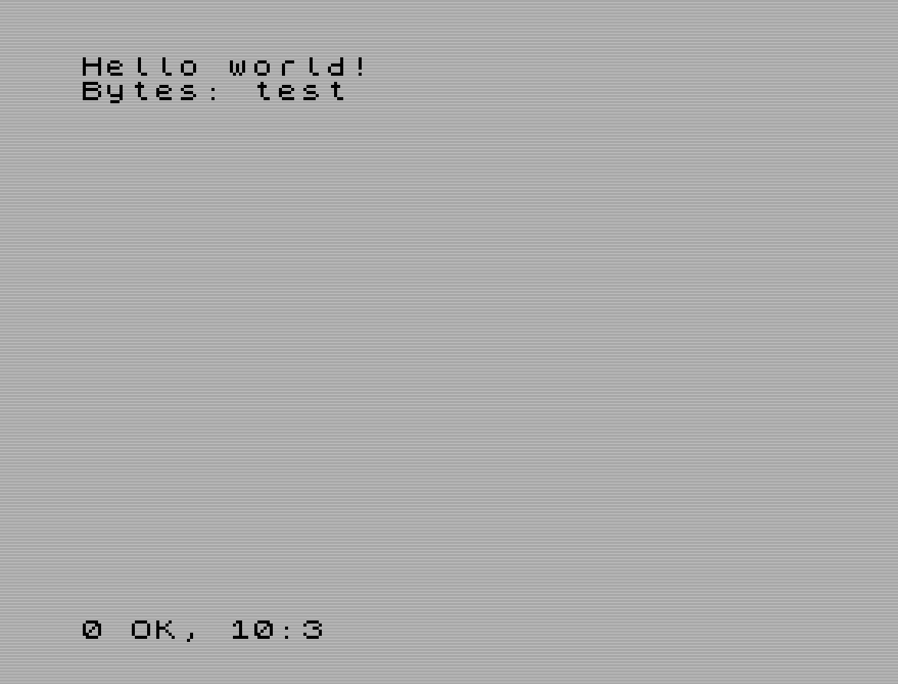

# Ensure RAGE1 requirements are installed and working

## Install Z88DK

As a first step we need to be sure that our toolchain for building RAGE1
games is correctly installed and functional.

As indicated in the [REQUIREMENTS](../REQUIREMENTS.md) file, having a
correct Z88DK installation is mandatory, since RAGE1 uses it for building
your game. Please follow the regular Z88DK installation instructions that
can be found [in this
link](https://github.com/z88dk/z88dk/wiki/installation).

- **Windows users:** you must use the [nightly
build](http://nightly.z88dk.org/) as indicated in the previous link.  RAGE1
has code that depends on some Z88DK bugs having been fixed recently, which
may not be fixed in old versions. Make sure you complete all instructions,
specially the ones related to setting the ZCCCFG environment variable and
adjusting the PATH variable.

- **Linux users:** I recommend building from source, it's just a matter of
installing requirements, then cloning the repo and issuing the following
commands inside the cloned repo:

    ```
    cd z88dk
    export BUILD_SDCC=1
    export BUILD_SDCC_HTTP=1
    chmod 555 build.sh
    ./build.sh
    ```

    After the build finishes, make sure you run the command for properly
    setting up the environment to use Z88DK (yes, that a dot at the
    beginning of line):

    ```
    . set_environment.sh
    ```

Once you have installed Z88DK, open a command terminal (if you still haven't
done it) and issue the `zcc` command with no arguments.  It should complain
with an error similar to the following:

```
zcc - Frontend for the z88dk Cross-C Compiler - v19544-c6b5d49d7-20220522

Usage: zcc +[target] {options} {files}

Options:
(...) (lots of options and lines)
```

At this point, Z88DK is installed and can be used.

## Make sure you can compile for ZX

After you have installed your Z88DK environment, we'll try to compile a
simple test program to ensure all the needed compilers and libraries are
also in place (they should be but who knows...)

Use a text editor (GEdit, Vim, Emacs, Notepad...), copy and paste the
following code:

```c
#include <stdio.h>

void main( void ) {
    puts( "Hello world!" );
}
```

Save it with name `test.c`, and then compile it with the following command.
It should compile and link without errors:

```bash
zcc +zx -vn -compiler=sdcc -clib=sdcc_iy test.c -o test -create-app
```

After this, a `test.tap` file should have been generated in the same folder
as the `test.c` file.  Run the `test.tap` file under a ZX Spectrum emulator
(my preferred one is [FUSE](http://fuse-emulator.sourceforge.net/)) and you
should get a text on the Spectrum screen like the following one:



The previous command line includes the specific compiler and C library that
RAGE1 uses:

- `+zx` instructs the compiler to generate code for the ZX Spectrum

- `-compiler=sdcc` selects the SDCC C compiler (Z88DK comes with two
  compilers, SCCZ80 and SDCC; SDCC is a bit better and generates more
  optimized code)

- `-clib=sdcc_iy` selects the C library to be used with the compiler

- `-create-app` tells the compiler to generate a `.tap` file after a
  successful compilation, ready to run in any Spectrum emulator.

If everything works OK we can be reasonably sure that everything
Z88DK-related is in place to create RAGE1 games, so we can jump ot the next
tutorial chapter.
